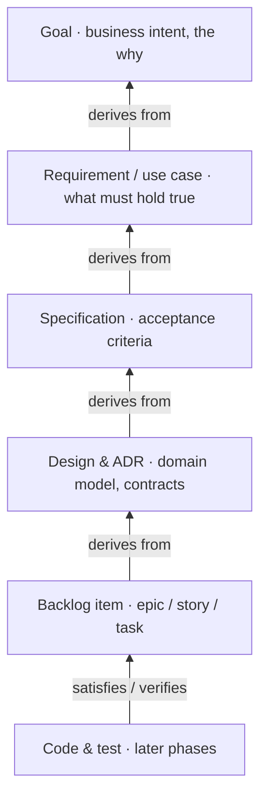

# Project Brief — LLM Agent SDLC Pipeline on a Hexagonal Monorepo

## 1. Objective
Build an internal platform that automates the software delivery lifecycle through a fleet of independently deployable **LLM-powered Java agents**. Each agent owns one SDLC capability, reasons with a language model, and calls **tools** when it needs to act. Everything lives in one **monorepo** under **hexagonal (ports & adapters)** architecture.

## 2. Confirmed scope
- **Agents**: autonomous, independently deployable services. Each runs an LLM-driven loop and invokes tools (git, shell, test runner, deploy, etc.) only when needed.
- **Runtime**: Java 25 (current LTS).
- **Intelligence**: every agent is LLM-backed; tool use is dynamic, decided by the model at runtime.

## 3. Why this shape
- **Hexagonal** keeps each agent's reasoning logic framework-free. The LLM, the tools, and the triggers are all *adapters* behind ports — so the agent loop is unit-testable with fakes, and we can swap model provider or CI system without touching domain logic.
- **Monorepo** gives a shared event vocabulary, atomic cross-agent changes, reusable tool adapters, and one build/version/CI toolchain.

## 4. Why Java 25
- **LTS** — safe long-term baseline.
- **Virtual threads** (final since 21): cheap concurrency, so one agent can handle many in-flight tasks dominated by LLM/tool I/O.
- **Scoped Values** (final in 25, JEP 506): propagate trace ID, tenant, and run context through the agent loop and into child threads without `ThreadLocal` leaks — directly useful for tracing agent steps.
- **Structured Concurrency** (preview in 25, JEP 505): clean fan-out when an agent fires several tool/LLM calls in parallel and needs unified cancellation and error handling. Adopt with `--enable-preview`, or defer until it finalises.

## 5. Anatomy of an agent (the reference template)
Each agent repeats the same internal layering, so a new agent is a copyable shape:
```
/agent-codereview
  /domain          # task model + policies (e.g. what a review finding is). No LLM/HTTP deps.
  /application     # the agent loop as a use case + all port interfaces
  /adapters
    /inbound       # webhook listener, queue consumer, scheduler  -> drive the agent
    /outbound      # implementations of the ports below
  /bootstrap       # Spring Boot / Quarkus main, wiring, config
```
**Ports the application layer depends on (all outbound, all faked in tests):**
- `LanguageModelPort` — send prompt + tool schemas, receive completion or tool-call requests.
- `ToolRegistry` / per-tool ports — `GitPort`, `ShellPort`, `TestRunnerPort`, `DeployPort`, `NotificationPort`.
- `MemoryPort` — conversation/run context store.

**The agent loop (lives in `application`, pure Java):**
1. Assemble context: system prompt + task + memory + schemas of available tools.
2. Call `LanguageModelPort`.
3. If the model requests tool calls → execute them through the `ToolRegistry` → feed results back → loop.
4. On a final decision → emit an SDLC event / side effect via an outbound port.
5. Guardrails throughout: max iterations, token/cost ceiling, and an **approval gate before irreversible actions** (merge, deploy).

**Key principle: tools are outbound adapters.** The model decides *which* tool; the application executes it through a port; the adapter does the real work. The domain never imports the LLM SDK or an HTTP client.

## 6. Discovery-loop agents (initial focus)
The platform's first focus is the **upstream loop** — turning intent into specs, design, and a maintained backlog — not delivery automation. Two principles drive the design:
- **Human-in-the-loop is the default interaction, not a safety gate.** These agents propose and clarify; humans decide. Elicitation and approval *are* the loop.
- **The traceability graph is the product.** Value comes from the living links *intent → requirement → use case → spec → design → story → (later) code & test*, and from propagating change when any upstream artifact moves. No vendor maintains your intent — this is the moat.

**The chain:**
- **Intent agent** — elicits and structures goals, requirements, and use cases; surfaces ambiguity, conflicts, duplicates, and gaps. Never invents requirements: every item cites its source input, and assumptions are flagged as assumptions.
- **Specification agent** — intent → testable spec (functional + non-functional requirements, constraints, Gherkin acceptance criteria); checks completeness and testability. The spec is the contract the downstream coding agents will consume. *Build this first — concrete, testable output makes it the cleanest reference agent.*
- **Design agent** — spec → domain model, API contracts, architecture, ADRs; reads the existing system for consistency; presents trade-offs rather than deciding unilaterally.
- **Backlog agent** — spec + design → epics/stories/tasks with dependencies and estimates; keeps Jira/Linear/ADO in sync; runs grooming and flags items orphaned by upstream change.

**Cross-cutting capability — traceability & change propagation:** model artifacts and their links as the context graph; emit an event on every artifact change; a propagation step re-validates downstream links and proposes updates to now-stale specs and stories. This connective tissue matters more than any single agent.

**Upstream-specific ports (added to §5's set):**
- `HumanInTheLoopPort` — ask clarifying questions, request approval.
- `BacklogPort` — Jira / Linear / Azure DevOps.
- `ArtifactRepositoryPort` — specs & ADRs as versioned, PR-reviewable files (spec-as-code, in the monorepo).
- `TraceabilityGraphPort` — read/write the intent→…→story graph.

**Guardrails for this phase:** ground every generated artifact in real input (traceability doubles as the anti-hallucination mechanism); propose-don't-commit, with approval gates between intent→spec→design→backlog; treat artifacts as *living* — detect drift continuously, not once.

## 7. Recommended structure
```
/platform
  /build-logic            # Gradle convention plugins
  /libs
    /domain-shared        # shared kernel: SDLC events, value objects
    /agent-core           # reusable agent loop + port contracts + ToolRegistry
    /traceability-graph   # intent->spec->design->story graph (core, shared)
    /adapter-llm          # LanguageModelPort impl (LangChain4j / Spring AI)
    /adapter-backlog      # Jira / Linear / Azure DevOps
    /adapter-artifact-repo # spec-as-code: specs & ADRs as versioned repo files
    /adapter-git          # GitHub/GitLab
    /adapter-ci
    /adapter-shell        # sandboxed command execution
    /adapter-messaging    # event bus client
  /agents
    # --- upstream / discovery (INITIAL FOCUS) ---
    /agent-intent         # elicit + structure goals, requirements, use cases
    /agent-spec           # intent -> testable spec (reference agent, build first)
    /agent-design         # spec -> domain model, API contracts, ADRs
    /agent-backlog        # spec+design -> epics/stories, sync Jira/Linear/ADO
    # --- downstream / delivery (later phases) ---
    /agent-codereview
    /agent-testgen
    /agent-build
    /agent-deploy
    /agent-releasenotes
  /orchestrator           # thin: human-approval workflows + ordered sagas only
```

## 8. Decisions (now firm)
1. **Agent model** — autonomous LLM + tool services. ✓ confirmed.
2. **Build tool** — **Gradle** multi-project with convention plugins: best Java monorepo ergonomics, remote build cache, affected-module builds. Bazel only if you outgrow it; Maven multi-module as the conservative fallback.
3. **Coordination** — **event choreography** over a message bus: agents subscribe to SDLC events and emit new ones. Keep the orchestrator thin — only for human approvals and order-sensitive sagas.
4. **LLM integration** — **LangChain4j** (model-agnostic, mature tool-calling) or **Spring AI** if you standardise on Spring; provider SDK sits behind `adapter-llm`.
5. **Deployment** — **independent deploy per agent** (independent scaling and release cadence); shared libs versioned inside the monorepo.

## 9. Cross-cutting concerns (LLM-specific)
- **Observability**: trace every step — prompt, tool calls, tokens, cost, latency — via OpenTelemetry; carry the trace ID with Scoped Values.
- **Safety / guardrails**: sandbox shell and code-execution tools; human approval gate for merge/deploy; allow-list tools per agent.
- **Prompts as code**: version prompts in the repo, reviewed like source.
- **Cost & rate limits**: per-agent budgets, response caching, model tiering (cheap model for routing, strong model for hard tasks).
- **Reliability**: idempotent event handling and retries — SDLC events can redeliver.

## 10. Build vs assemble vs buy
A full Harness-equivalent platform is a multi-team, multi-year effort — but most of it is undifferentiated. The rule of thumb: **build only the agents and the context layer; assemble everything else from proven open source; buy/reuse what you already have.** Effort is T-shirt sized (S/M/L/XL).

| Layer | What it does | Effort to build | Verdict | Recommended building block |
|---|---|---|---|---|
| Workflow / pipeline engine | Durable multi-step execution: retries, parallelism, conditional routing, long waits for approval, crash recovery | XL | **Assemble / reuse** — never write from scratch | Temporal or Conductor; or reuse existing CI/CD (Argo Workflows, GitHub Actions) |
| Secrets | Scoped secret storage + injection into agent steps | M | **Buy / assemble** | HashiCorp Vault, or cloud KMS (AWS/GCP Secrets Manager) |
| RBAC / authz | Who can run, approve, and act on what | L | **Assemble** | OPA/Rego, Cerbos, or SpiceDB (Zanzibar-style) |
| Audit trail | Immutable, queryable record of every agent action | M | **Assemble** | Append-only events on your existing bus (Kafka) → queryable store |
| Sandboxed tool execution | Contain shell/deploy/code tools so an LLM step can't escape its blast radius | L | **Assemble** | Ephemeral containers + gVisor / Firecracker / Kata; or ephemeral CI runners |
| Connectors / integrations | Git, cloud, registries, K8s, scanners, notifiers | L (perpetual) | **Buy / reuse** | Prefer MCP servers + vendor SDKs over bespoke connectors |
| Knowledge / context graph | Unified model of commits, builds, deploys, services, incidents | L | **Build (start small)** — partly differentiating | Postgres first; Neo4j only if graph queries demand it; ingest from existing events |
| **Agents (LLM loops)** | Reason → call tools → act, per SDLC capability | M | **Build — this is your differentiation** | Spring AI / LangChain4j / ADK behind `adapter-llm` |
| Observability + cost | Trace prompts, tool calls, tokens, latency, spend | M | **Assemble** | OpenTelemetry + Langfuse (or Phoenix/Arize) for LLM-specific tracing/cost |
| Eval harness | Score agent behaviour against test sets on each change | M | **Assemble** | ADK eval, Langfuse evals, or promptfoo |
| Pipeline / run UI | Author, inspect, and debug runs | L | **Buy / defer** | Reuse CI UI, Temporal Web, or Backstage; build last |

**Net:** the only layers you genuinely own are the **agents** and a **lean context graph**. Everything else is commodity infrastructure better assembled than authored — and if your CI/CD already provides the workflow + governance substrate, the build shrinks dramatically.

## 11. Phasing
- **Phase 0** — Repo skeleton, build-logic, `domain-shared`, `agent-core`, the **traceability graph**, and the **Specification agent** running end-to-end as the architectural template (with ArchUnit enforcing hexagonal boundaries in CI).
- **Phase 1** — Add the **Intent, Design, and Backlog agents**; wire `HumanInTheLoopPort` and backlog sync; close the upstream loop with change propagation across the traceability graph.
- **Phase 2** — Extend downstream (code-review, test-gen, deploy…) consuming the specs the upstream agents produce; add the event backbone, full observability, and cost governance.

---

## 12. Appendix A — Traceability graph schema (detailed)

### 12.0 Metamodel at a glance
The node types and the derivation spine that links them. Arrows point in the stored `DERIVES_FROM` direction — each artifact points up to the source it was derived from (the bottom link is the reverse `SATISFIES`/`VERIFIES`). Colour grouping: intent (Goal, Requirement/Use case), elaboration (Specification, Design, Backlog), future (Code & test).



### 12.1 Design approach: Git is the version store
Because specs live as **spec-as-code** in the monorepo, the graph does **not** store artifact content — it stores **identity, links, and status** over files that live in Git.
- **Canonical source of truth = each artifact file's frontmatter.** Every artifact declares its own ID, type, and the IDs it derives from. Reviewable in PRs; cannot silently drift.
- **Version = the Git blob SHA** of the artifact file. Reuse Git's content addressing instead of inventing versioning. Identity (a stable logical ID) is separate from version (the blob SHA, which changes per edit).
- **Query model = a projection** (Postgres) rebuilt from commits, for fast traversal and staleness queries.

Flow: a commit touches artifact files → CI emits `ArtifactChanged` events → projection updated → staleness recomputed → affected agents/humans notified.

### 12.2 Identity scheme
Stable, human-readable IDs, referenceable in PRs and commits; permanent across file moves/renames: `GOAL-0001`, `REQ-0012`, `NFR-0004`, `UC-0003`, `SPEC-0007`, `ADR-0002`, `API-0001`, `STORY-0042`, and (future) `CODE-…`, `TEST-…`.

### 12.3 Node model
Common fields: `id`, `type` (Goal | Requirement | NFR | UseCase | Specification | DesignElement | ADR | ApiContract | BacklogItem | Code | Test), `title`, `repoPath`, `blobSha` (= version), `status` (DRAFT | PROPOSED | APPROVED | NEEDS_REVALIDATION | DEPRECATED), `version`, `provenance` (§12.5), `createdAt`, `updatedAt`.
Per-type extras: Goal `priority`/`successMetric`; Requirement `kind`/`moscow`; UseCase `actor`/`mainFlow`/`altFlows`; Specification `acceptanceCriteria`/`constraints`; ADR `decision`/`alternatives`/`consequences`/`adrStatus`; BacklogItem `level`/`estimate`/`externalRef`/`sprint`.

### 12.4 Edge model
Edge types: `DERIVES_FROM` (the spine), `SATISFIES`, `VERIFIES`, `DEPENDS_ON`, `CONFLICTS_WITH`, `DUPLICATES`, `CONSTRAINS`, `SUPERSEDES`.
Edge fields: `id`, `type`, `from`, `to`, `upstreamBlobShaAtLink` (the `to`-node's `blobSha` when last validated — the key field), `linkStatus` (CURRENT | STALE | ORPHANED | REJECTED), `establishedBy`, `validatedAt`, `validatedBy`.

### 12.5 Provenance (anti-hallucination)
Every node carries: `sourceRefs` (pointers to the raw input it was grounded in), `generatedBy` (agent + model + prompt version), `confidence`, `assumptions` (explicit, never silent), `humanApproved` (+ `approvedBy`, `approvedAt`).
Rules: a node cannot reach `APPROVED` without `humanApproved = true`; a node with empty `sourceRefs` **and** no `assumptions` is invalid.

### 12.6 Change propagation (the moat)
On `ArtifactChanged(nodeId, newBlobSha)`: (1) update `blobSha`, bump `version`; (2) find edges `X --DERIVES_FROM|SATISFIES--> nodeId` where `upstreamBlobShaAtLink != newBlobSha`; (3) mark those edges `STALE`, mark `X` `NEEDS_REVALIDATION`; (4) recurse transitively (flag only, don't bump SHA); (5) emit `RevalidationRequested`. The owner re-validates and re-stamps the edge to `CURRENT`. Deprecated/deleted upstream → inbound edges `ORPHANED`. The headline query — "what's stale if intent changes?" — is one lookup over `status` + inbound `linkStatus`.

### 12.7 In-repo representation (canonical)
```yaml
---
id: SPEC-0007
type: Specification
title: Checkout applies regional tax
status: APPROVED
derivesFrom: [REQ-0012, UC-0003]
constrainedBy: [ADR-0002]
provenance:
  sourceRefs: [conv:2026-06-03#msg42, ticket:PROJ-88]
  generatedBy: agent-spec@v3
  confidence: 0.82
  assumptions: ["tax rounding follows local jurisdiction rules"]
  humanApproved: true
  approvedBy: a.dupont
---
## Acceptance criteria
Scenario: ... (Gherkin)
```
The projection parses frontmatter into edges; `blobSha` comes from Git; the body is not duplicated into the graph.

### 12.8 Projection (query model) — Postgres
`nodes(id PK, type, title, repo_path, blob_sha, status, version, provenance jsonb, created_at, updated_at)` and `edges(id PK, type, from_id FK, to_id FK, upstream_blob_sha_at_link, link_status, established_by, validated_at, validated_by)`. Index `edges(to_id, link_status)`, `edges(from_id)`, `nodes(status)`. Recursive CTEs cover transitive impact; Neo4j only if deep traversals later demand it.

### 12.9 Hexagonal binding — `TraceabilityGraphPort`
```java
interface TraceabilityGraphPort {
    Node get(NodeId id);
    void upsert(Node node);
    void link(Edge edge);
    List<Node> downstreamOf(NodeId id, EdgeType... types);
    List<Node> staleNodes();
    List<Node> impactOf(NodeId changed);
    void revalidate(EdgeId id, String validatedBy);
}
```
Agents depend only on this port; the adapter implements it over the projection plus a Git reader.
